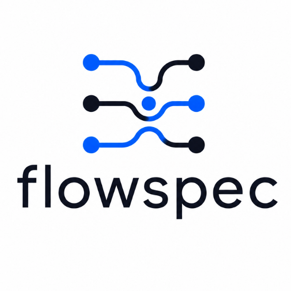

<p align="center">
  
</p>

# FlowSpec

A declarative, engine-agnostic specification language for AI-driven acceptance testing, plus the site that documents it.

A FlowSpec document describes user journeys — flows, checkpoints, semantic interactions, expected outcomes — and leaves *how* to perform them to an execution engine: an AI browser agent, a Playwright adapter, a mobile agent. FlowSpec is to AI acceptance testing what OpenAPI is to REST APIs.

## What's here

| File | Purpose |
|---|---|
| [`public/spec-final.md`](public/spec-final.md) | **The specification.** FlowSpec 1.0 — document format, actions, assertions, evidence, graph model, execution lifecycle, results output. |
| [`public/SKILL.md`](public/SKILL.md) | A condensed skill for AI agents. Drop it into an agent's skills directory — or run `./install-skill.sh` — to author, review, and run FlowSpec documents via `/flowspec` commands. |
| [`public/llms.txt`](public/llms.txt) | Machine-readable overview for LLMs, following the llms.txt convention. |
| `index.html` | The documentation site — renders the spec at runtime. |

## Installing the skill

One file, no dependencies. Drop it anywhere your agent reads skills from — `~/.claude/skills/` and `~/.agents/skills/` for a global install, `<project>/.claude/skills/` for one project.

```bash
# direct download
mkdir -p ~/.claude/skills/flowspec
curl -fsSL https://raw.githubusercontent.com/daveconstell/flowspec/main/public/SKILL.md \
  -o ~/.claude/skills/flowspec/SKILL.md
```

```bash
# or clone and use the installer — writes to both skill directories
git clone https://github.com/daveconstell/flowspec.git
./flowspec/install-skill.sh              # global (~)
./flowspec/install-skill.sh /path/to/app # project-local
```

Restart the agent session, then `/flowspec` to confirm it loaded.

## Using FlowSpec

FlowSpec is a specification, not a test runner — there is no reference implementation yet. To adopt it:

1. **Annotate your UI.** Add `data-constell="component-name"` to every element a test must reach. Name by role, not appearance. Already using `data-testid` or another convention? Set `targetAttribute` instead of migrating markup. If the configured attribute turns out to be absent from the page entirely, engines detect the convention the page actually uses (`data-constell`, `data-testid`, `data-qa`, `data-test`), run with it, and flag the config mismatch — instead of failing every step.
2. **Author your documents.** Keep one per page or area in `.flowspec/`, with project settings in `.flowspec.json`:

   ```
   .flowspec.json          # baseUrl, targetAttribute, output
   .flowspec/
   ├── venue-landing.json
   ├── admin/users.json
   └── fixtures/           # files referenced by upload steps
   ```

   See §3.2 of the spec for the layout and §16 for a complete document.
3. **Run it.** Give an AI coding agent `SKILL.md` plus your document, or write a thin adapter mapping FlowSpec actions onto Playwright/Selenium.

   With the skill installed (`./install-skill.sh`, or pass a project path for a local install), the agent answers to slash commands:

   | Command | Does |
   |---|---|
   | `/flowspec` | Report setup state and the command list |
   | `/flowspec init` | Detect `baseUrl`/`targetAttribute`, write `.flowspec.json`, create `.flowspec/` |
   | `/flowspec add <page or journey> [file]` | Author: a page → read it, ask what to test, author what's chosen; a journey → add it to the page's document, creating the file if missing |
   | `/flowspec review [file]` | Check against the review checklist and fix what's unambiguous |
   | `/flowspec run [file] [--url X] [--headed]` | Execute the journey and write `flowspec-results/` |
   | `/flowspec targets [file]` | List targets that don't resolve in the source — read-only |
   | `/flowspec spec <topic>` | Answer a spec question — actions, assertions, edges, evidence |
4. **Consume the results.** Conformant engines write `flowspec-results/` — `report.json`, optional JUnit `report.xml`, and evidence artifacts referenced by relative path. Multi-document runs nest per document id, mirroring the `.flowspec/` tree. Exit `0` passed, `1` failed, `2` errored.

## Running the site

```bash
npm install
npm run dev      # http://localhost:5173
npm run build    # → dist/
npm run preview  # serve the production build
```

Vite with no framework: one `index.html`, Tailwind via CDN, and `marked` + `mermaid` loaded as ESM to render the spec markdown at runtime. Editing `public/spec-final.md` updates the page — there is no second copy of the spec to keep in sync.

## Status

Spec version 1.0, **draft**. The document format is stable enough to author against; expect refinement of the runner-facing sections (§13–§14) as real engines are built.

## License

[MIT](LICENSE) — an open specification by Constell.
