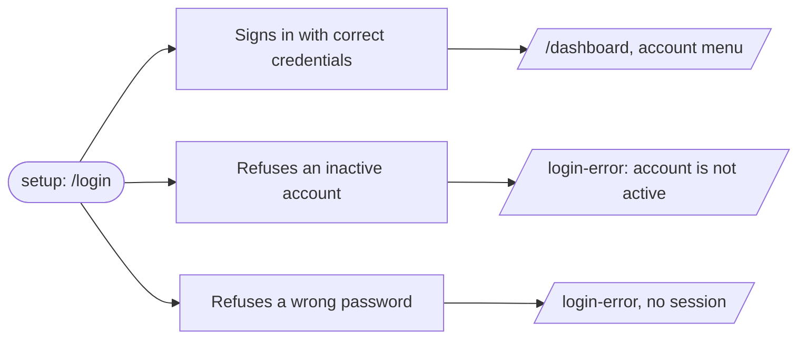

# Writing FlowSpec flows

A FlowSpec document is one feature journey, described as intent and never as automation. The full spec lives at [spec-final.md](https://github.com/daveconstell/flowspec/blob/main/public/spec-final.md); this is the working reference.

```
login_flow.json                       ← the flow: one feature, one file
├── valid-credentials                 ← a case: one path through it
│   ├── steps: fill the form, submit  ← how to reproduce the path
│   └── assertions: lands on /dashboard
├── inactive-account                  ← cases are siblings, not a chain
└── invalid-credentials
```

Every case is expected to **pass**, sad paths included: `inactive-account` passes when the refusal appears, and fails only when the app lets a dormant user in. Nothing in a FlowSpec is ever authored as an expected failure.

## Commands

Invoked as `/flowspec <command>`. Eight commands, nothing else. Match the first word exactly; no args, an unknown word, or anything ambiguous → `help`, never a guess at which command was meant.

| Invocation | Do this |
|---|---|
| `/flowspec help` | Print this table plus the setup state — `.flowspec.json`, the flows in `.flowspec/`, the effective `targetAttribute`, and whether testing tooling is connected (§ *Global guards*). Changes nothing. Also the answer to no args or an unrecognised command. |
| `/flowspec init` | Bootstrap: § *Init*. Detect settings, write `.flowspec.json`, create `.flowspec/`, gitignore the output dir. Already set up → show the config and say so, don't overwrite. |
| `/flowspec run [file] [case] [--url X] [--headed]` | § *Running a flow*. No file → every flow in `.flowspec/`; a file → that flow; a file **and** a case id → that one case, with `setup` and `cleanup` still running around it. `--url` overrides `baseUrl`; `--headed` shows the browser. |
| `/flowspec flow:new` | Create a flow: § *flow:new*. One feature, one file, its paths as cases. Offers to walk each path in a live browser when tooling allows. |
| `/flowspec flow:set` | Update a flow's own fields — name, description, variables, setup, cleanup: § *flow:set*. Not its cases; that's `case:set`. |
| `/flowspec case:new` | Add a case to an existing flow: § *case:new*. **Ask which flow first** — always. Then walk the path in the browser, or derive it from the source. |
| `/flowspec case:set` | Update an existing case: § *case:set*. **Ask which flow, then which case** — always. |
| `/flowspec mermaid [file]` | Render a flow as a diagram: § *mermaid*. Read-only, no browser, no edits. |

Every command that writes runs the § *Global guards* first.

## Global guards

Two checks that apply to **every** command, before it does anything.

### 1. Is testing tooling connected?

Before promising, offering, or attempting a run, check what is actually available — connected MCP servers first (Chrome DevTools MCP, Playwright MCP), then a runner in the project (Playwright, Cypress, Puppeteer). Details and detection in § *First: find the browser tooling*.

- `help` and `init` **report** what they found, so the answer is known before anyone writes a flow.
- `run` **requires** it. Nothing available → say so and stop. A run you cannot perform is not a passing run, and never fabricate results.
- `flow:new` and `case:new` **use** it when it's there: they offer to walk the path in a live browser rather than derive it from the source (§ *Walking the path in the browser*). This is the better authoring route — take it whenever it's available and the user agrees.
- `flow:new`, `flow:set`, `case:new`, `case:set` may author without it, but **MUST NOT** offer to run at the end when nothing can run. Say what's missing and give the one-line install instead.
- `mermaid` needs nothing.

### 2. Never invent setup or variables — ask

The moment authoring touches a precondition or a value, **stop and ask**. Do not infer, do not use a plausible placeholder, do not defer it to a `TODO`.

| What the source shows | Ask for |
|---|---|
| An auth guard on the route | a **test** account's email and password — never production credentials |
| A case needing a specific account state (dormant, locked, unverified, over quota) | credentials for an account actually in that state, or how to get one |
| A record that must exist (an order, a venue, an invite) | how it gets seeded, and what identifies it |
| A form field whose value changes the outcome (a real inbox, a card number, a promo code) | the value to use |
| A page reachable only after other steps | whether those steps belong in `setup` or in the case |

The answers become `variables` and `setup`. Two things to say when asking: `setup` runs **before every case** in the file, so it has to hold for all of them; and the values land in a **committed** file, so anything sensitive should be a throwaway — engines allow overriding variables at invocation.

Everything else gets a dummy without asking: names, addresses, lorem text, anything a wrong guess cannot break. Ask about what matters, not about everything.

## Init

`.flowspec.json` or `.flowspec/` present → read the config, report it, change nothing. Neither → bootstrap. **Detect before asking** — most of the configuration is already sitting in the repo:

| Setting | Detect from | Ask when |
|---|---|---|
| `targetAttribute` | grep the app source for `data-constell`, `data-testid`, `data-qa`, `data-test` — the convention already in use wins | nothing is annotated yet (propose `data-constell`), or two conventions are in genuine use |
| `baseUrl` | dev server port in `vite.config.*`, `next.config.*`, `package.json` scripts, `docker-compose.yml` | no dev server is discoverable |
| `output` | — | never — default `flowspec-results` |

Write `.flowspec.json`, create `.flowspec/`, add `flowspec-results/` to `.gitignore`, report the testing tooling found (§ *Global guards*), and stop. Don't author a flow — that's `flow:new`, and it's the user's call which feature comes first. `.flowspec.json` matters more in a per-file layout than it looks: with no container document, it is the only place `baseUrl` and `targetAttribute` get stated once for every flow.

## flow:new

One feature, one file, its paths as cases. **Never go straight to a written file.** A feature name is scope, not a list of paths, so don't invent cases the user didn't ask for.

First ask what feature it covers, if the invocation didn't say. Then read the source — route, components, forms, guards, error states, what the markup already annotates — and run the authoring conversation, each question pre-answered from the source so the user corrects rather than dictates:

1. **Which paths do you want covered?** Present what the feature offers as candidate cases, happy and sad alike — a rejection is as much a path as a success, and the sad ones are usually where the bugs are. One line each: the path in plain words, its case id, any targets that would need annotating. Ask which the user wants, and what you missed. This is the only question asked cold.
2. **What are the steps?** For each chosen path, derive the reproduction steps from the source — the form's fields, the button that submits — and show them as intent, not mechanics. A path that crosses three pages is still **one case**; don't split it. Ask only where the source leaves the path ambiguous (two ways to reach the same outcome, an order that matters).
3. **What's the expected outcome?** Derive the assertions the source supports — the redirect, the banner, the specific error text — and show them. For a sad path the outcome is the refusal: assert the message the source actually renders, not just that *something* failed. Only when an end state is genuinely invisible in the source, ask; never guess what "should" happen.
4. **What's the setup, and what data does it need?** § *Global guards* rule 2 — always ask, never invent. `setup` runs before every case, so it must hold for all of them.

Once `setup` is settled and the paths are chosen, offer to **walk each one in the browser** (§ *Walking the path in the browser*) if tooling is connected and `baseUrl` answers — steps 2 and 3 above then come from the live page instead of the source. Walk one path at a time, writing each case as it's confirmed.

Rules while authoring:

- Filenames are `snake_case` with a `_flow` suffix — `login_flow.json`, `request_quote_flow.json`. Case ids and target names stay kebab-case and name the path (`inactive-account`, not `case-2`).
- A flow already covers this feature → stop and say so; `case:new` adds to it. Never author a second file for one feature.
- No `id` field at the top level — the filename is the id.

Present the beats as one proposal, author exactly what was confirmed, then § *Close out*.

## flow:set

Updates a flow's own fields: `name`, `description`, `tags`, `variables`, `setup`, `cleanup`, and a deliberate `baseUrl`/`targetAttribute` override. Its cases belong to `case:set`.

1. **Ask which flow** if the invocation didn't name one — list what's in `.flowspec/` with case counts. Never guess.
2. **Read it and say what you're changing**, in one line, before touching it.
3. **Editing `setup` or `cleanup` changes every case in the file.** Say which cases are affected and confirm before writing. This is the one edit that can quietly invalidate cases that were passing.
4. **Removing a variable** that a case still interpolates would break the flow at load. Find the references first; report them instead of writing a broken file.
5. **New precondition or value needed** → ask (§ *Global guards* rule 2).

Then § *Close out*.

## case:new

Adds one path to an existing flow. This is where a happy path becomes a real test — mostly by adding the paths nobody volunteered.

1. **Ask which flow. Always.** Even when only one flow exists, even when the request names a feature that seems obvious — list the flows and have the user pick. A case written into the wrong file is worse than a question: it tests the wrong feature under the wrong `setup`. No flow fits the path → say so and offer `flow:new` instead of forcing it into a neighbour.
2. **Read the flow and the source.** The flow's `setup`, `variables`, and existing cases answer most of what follows — never re-ask what the file already settled.
3. **An existing case already covers this path** → say so and offer `case:set` to sharpen it. Never author a near-duplicate under a new id.

**Then pick how to derive the path.** Browser tooling connected *and* `baseUrl` reachable → offer the walk, because reading the live page beats guessing at the source:

```
Chrome DevTools MCP is connected and localhost:5173 is up.
  1. Walk it in the browser — I drive, you say what's next  (recommended)
  2. I'll derive the steps from the source and you correct me
```

Take the answer at face value; don't push. Nothing connected, server down, or the user picks 2 → the source-derived route below.

**Source-derived route** — ask only what neither the source nor the flow answers:

1. **Outcome** — "what does this path end with?" Skip when the source shows it (a redirect, a banner, a state change).
2. **The other paths** — list every validation, rejection, guard, and empty state the source reveals and ask which to add as cases too. They're where the valuable cases live. Each becomes an ordinary case asserting its refusal, never an expected failure.
3. **Preconditions and data** — § *Global guards* rule 2. A sad path usually needs its own values (`inactiveEmail`, `wrongPassword`); ask for them. If the path needs a precondition the flow's `setup` doesn't establish, say so and ask whether to extend `setup` — which affects every case — or reproduce it in this case's steps.

Then § *Close out*.

## Walking the path in the browser

The interactive route for `case:new` and `flow:new`: you drive a real browser, the user says what happens next, and each answer becomes one FlowSpec step. The user never sees a selector and never writes JSON.

**Before the first navigation:**

- **Confirm the environment out loud.** The walk *actually performs* every step — it submits forms, creates records, sends mail. Say which origin you're about to drive and get a yes. If `baseUrl` looks like production, say so plainly and ask for a local or staging origin instead; don't walk a real customer's data.
- **Run the flow's `setup` first**, exactly as an engine would, so the walk starts where every case starts. Report where that landed you.

**Then loop, one exchange per step:**

1. **Say where you are and what's reachable.** Current URL, and the interactive components on the page *by target name* — the ones carrying the effective `targetAttribute`. Also name the obvious controls that **lack** it: those are the annotation work this case will need.
2. **Ask what's next**, in plain words — *"what does the user do here?"* Never offer a list of actions; the user describes intent, you choose the action.
3. **Translate, execute, report.** Map the answer to one FlowSpec step, run it through the MCP, then say what actually changed: the new URL, what appeared or vanished, any console error. If the page did something unexpected, that's worth flagging now — it may be the bug the case exists to catch.
4. **Repeat until the user says the path is done.**

**Then, once — at the end:**

5. **Ask the acceptance criteria.** *"The path is done. What must be true for this to count as passing?"* Propose what you can see (the URL it landed on, the message that appeared, zero console errors) and let the user add what you can't infer. These become the case's `assertions`.
6. **Confirm the case id and name**, then write it and § *Close out*.

### Rules for the walk

- **Every step must be a FlowSpec action on a semantic target.** No coordinates, no CSS, no "the third button". If the element the user just described has no target attribute, **stop**: offer to add one named by role, and only then record the step. A recorded case that can't be replayed by another engine is worthless — this is the whole discipline of the walk.
- **You perform, you don't interpret.** Record what the user said to do, not the mechanics you used to do it. If you fulfilled "sign in" with three keystrokes and an Enter, the step is still `fill` + `click`.
- **Assertions are end-of-path only.** FlowSpec evaluates them after all steps (§8), so there is nowhere to put *"at this point the spinner shows"*. When the user voices a mid-path expectation, say so and offer the honest options: it's a **shorter case** through the same feature — same `setup`, steps up to here, that expectation as its assertions — or it's a `wait` step and the real assertion comes later. Never silently drop it, and never invent per-step assertions the spec doesn't have.
- **Undo means replay.** Asked to redo a step, re-run `setup` and replay the confirmed steps before it. Don't hand-patch browser state; the case has to work from a cold start or it isn't a case.
- **Don't let the walk become the case's shape.** Detours, dead ends, and retries during the conversation are not steps. Record the path the user settled on.
- **One walk, one path.** A branch the user notices along the way (*"and if the card is declined…"*) is a separate case — note it, finish this one, offer it next.
- **The user's words are the descriptions.** *"Send the quote request"* is exactly the `description` a report should print. Keep their phrasing over yours.

### Worked exchange

```
setup ran → you're on /login (signed out)
Reachable: login-form, login-email, login-password, login-submit
Not annotated: the "Forgot password?" link

You: what does the user do here?
Them: enter a dormant account's email and the right password, then sign in

→ fill login-form { login-email: {{inactiveEmail}}, login-password: {{password}} }
→ click login-submit
Now on /login · login-error appeared: "This account is not active."
· 0 console errors

You: what's next?
Them: nothing, that's it

You: what must be true for this to pass?
  I can see: still on /login, login-error reads "This account is not active."
Them: also make sure it never reaches the dashboard

→ assertions: text login-error contains "not active" · url contains /login
              hidden account-menu
→ case id: inactive-account · "Refuses an inactive account"
```

Note what happened there: the refusal is the **passing** outcome (§ Rules 4), and `{{inactiveEmail}}` was asked for, not invented (§ *Global guards* rule 2).

## case:set

Updates an existing case's `name`, `description`, `steps`, `assertions`, or `evidence`.

1. **Ask which flow. Always** — same guard as `case:new`, same reason.
2. **Then ask which case**, listing the flow's cases by id and name. Never infer from a partial description.
3. **Read it and say what you're changing** before touching it. Show the current steps or assertions next to the proposed ones when the change is more than a wording fix.
4. **Never turn a case into an expected failure.** If the app's real behaviour differs from what the case asserts, that's either a spec fix (the assertion was wrong) or a bug (the app is wrong) — ask which, and don't quietly relax an assertion to make a run go green.
5. **New precondition or value needed** → ask (§ *Global guards* rule 2).

Then § *Close out*.

## mermaid

Renders a flow as a diagram, derived from the file. Read-only: no edits, no browser, no writes unless the user asks for one.

Ask which flow if the invocation didn't name one. Because cases are independent (§ Rules 3), a flow is a **fan, not a chain** — one shared starting state, one branch per case, one outcome per branch:



Rules:

- One node for `setup`, labelled with the state it establishes — usually the page every case starts on. No setup → start the branches from a node named after the flow.
- One node per case, labelled with its `name`, falling back to `id`.
- One terminal node per case, labelled from its assertions — the URL it lands on, the target or text that must appear. Keep it to the one or two that define the outcome; the diagram is a map, not the spec.
- **Never draw an edge between two cases.** They are independent paths, and an arrow between them would state something the flow does not.
- `cleanup`, if present, is not drawn — it runs per case and adds nothing to the picture.

Print the fenced block in the reply. Offer to write it to a file only if the user wants it committed; suggest `.flowspec/<flow-id>.mmd` and never overwrite the flow's `.json`.

## Close out

Every authoring command ends the same way:

1. **Targets exist** — verify or add every new target in the markup (§ *Targets must exist*). Sad paths usually need targets like `login-error` that the happy path never touched.
2. **Check the § *Review checklist*** against what you wrote — unique case ids, declared variables, a `setup` that fits every case, no expected failures.
3. **Offer to run it** — `run <file>`, or `run <file> <case>` for just the case you touched. Only if tooling exists (§ *Global guards* rule 1); otherwise name what's missing and the one-line install.

Never author steps only one engine could execute — the flow stays engine-agnostic.

## Targets must exist in the markup

A flow whose targets don't resolve errors on every step, so before writing `"target": "quote-submit"`, confirm the component carries the attribute — search the source for `<targetAttribute>="quote-submit"`. If it doesn't:

- **Add it.** A one-line attribute on the component is the fix, named by role (§ Rules 1). This is the normal path — annotate as you author.
- **Or stop and list.** If the source isn't yours to edit, report the components needing annotation instead of authoring against names that don't exist.

Never invent a target you have neither verified nor added.

## Project layout

```
.flowspec.json                  # project config: baseUrl, targetAttribute, output
.flowspec/
├── login_flow.json             # one feature per file
├── request_quote_flow.json
├── admin/invite_user_flow.json # nesting allowed; id is the path minus extension
└── fixtures/                   # reserved — files for upload steps, never a flow
flowspec-results/               # generated, gitignored
```

Settings resolve **invocation → flow → `.flowspec.json` → spec default**. Put `baseUrl` in the config file, not in flows: the origin changes between laptop, CI, and staging; the journey does not.

```json
{
  "spec": "1.0",
  "baseUrl": "http://localhost:5173",
  "targetAttribute": "data-testid",
  "output": "flowspec-results"
}
```

## Flow skeleton

The top level **is** the flow — no wrapper, no `flows` array, one `setup`/`cleanup`:

```json
{
  "spec": "1.0",
  "name": "Login",
  "description": "How a user signs in, and how signing in is refused.",
  "variables": { "email": "john@example.com", "password": "correct-horse" },
  "setup":   [ { "action": "clear-storage" }, { "action": "navigate", "url": "/login" } ],
  "cases":   [],
  "cleanup": [ { "action": "clear-storage" } ]
}
```

Required: `spec`, `name`, `cases`. There is no `id` field — the flow's id is its filename (`login_flow`), so it can't collide or drift.

```
for each case:  setup → steps → assertions → evidence → cleanup
```

**`setup` runs before every case**, not once per flow — that's what keeps the paths independent. In a login flow, `valid-credentials` signs a user in; without a fresh setup the next case would start already authenticated and test nothing it claims to. It's `beforeEach`, for the same reason every test framework has one. So setup must leave the app in the state *every* case starts from — usually `clear-storage` plus the page they all begin on.

A failing setup step makes that case `error`, not `failed`: a precondition problem is not a product bug. The remaining cases are still attempted. Within a case, `navigate` is an ordinary step, so one path can cross as many pages as it likes and still be one case.

Flows are independent of each other too — engines may run them in any order or in parallel, and no flow may rely on another's leftovers. Preconditions shared by several flows are **repeated** in each `setup`; a few duplicated navigate-and-sign-in steps cost less than a shared fixture that silently changes what a flow tests. Imports are out of scope for 1.0.

## Rules

1. **Targets are semantic names** carried by a data attribute: `"target": "quote-submit"` → `[data-constell="quote-submit"]`. Never CSS or XPath. Lowercase kebab-case, named by role, stable across redesigns.
   The attribute defaults to `data-constell`; set it in `.flowspec.json` to match an existing convention (`data-testid`, `data-qa`, …) instead of migrating markup. One attribute per flow — no fallback chains. A name matching **more than one element is an error** (except in `count`), so a target must be unique on the page — a repeated component gets indexed names (`package-card-1`) or a `count` assertion.
2. **Variables** interpolate with `{{name}}`. Referencing an undefined variable fails at load. They're per-flow — no cross-file scope.
3. **A case is one path, end to end.** Its steps are the reproduction steps; crossing pages doesn't make it several cases. Array order is presentation only — **every case runs**, whatever the others did, and engines may run them in any order or in parallel.
4. **Sad paths are ordinary cases**, expected to pass. `inactive-account` asserts the refusal appears and the user stays put; it fails only if the app lets them in. Never author a case as an expected failure — `failed` is always a verdict on the app, never on the path.
5. **All assertions in a case are evaluated** even after one fails. A step failure (missing target, timeout) is an `error` and skips the rest of that case, but not the other cases.
6. **Evidence** (`screenshot`, `dom`, `html`, `a11y-tree`, `network`, `console`, `reasoning`, `performance`): flow-level default, case-level override. Screenshots + console are always captured on failure, and `timing` always — don't declare evidence for those.
7. **Describe intent, never mechanics.** `description` is optional on the flow, cases, steps, and assertions, and it becomes the failure message in reports — write it so someone who has never read the spec understands the failure. `"Dismiss the cookie banner"` ✅ · `"scroll 200px then click the blue button"` ❌ (that's the engine's job).

## Naming and describing

| Level | `name` | `description` |
|---|---|---|
| Flow (the file) | **required** | optional |
| Case | optional | optional |
| Step | — | optional — intent, used in reports and as an AI disambiguation hint |
| Assertion | — | optional — the expectation, used as the failure message |

Case names default to `id` when absent, and read as a verdict on the app: *"Refuses an inactive account"*, not *"test 2"*. Engines carry names and descriptions through into the report, so a failure reads *"The confirmation banner appears — failed"* instead of `visible: success-message`.

## Actions

| Action | Required fields |
|---|---|
| `navigate` | `url` — absolute, or a path resolved against `baseUrl` |
| `click`, `double-click`, `hover`, `submit`, `download`, `focus`, `blur` | `target` |
| `fill` | `target`, `values` (keys = field target names) |
| `select` | `target`, `value` |
| `upload` | `target`, `file` — resolved from the project root, e.g. `.flowspec/fixtures/x.pdf` |
| `press-key` | `key` (`target` optional) |
| `wait` | `seconds` or `target` (exactly one) |
| `scroll` | `target` or `to: "top" \| "bottom"` |
| `refresh`, `back`, `forward` | — |
| `clear-storage` | — · **setup/cleanup only** — clears cookies, localStorage, sessionStorage |

All steps accept optional `description` (intent) and `timeout` (seconds, default 30).

## Assertions

| Type | Required fields |
|---|---|
| `exists`, `visible`, `hidden`, `enabled`, `disabled`, `checked`, `unchecked` | `target` |
| `count` | `target`, `expected` (number) |
| `text` | `target`, `expected` (`match`: `"contains"` default, or `"exact"`) |
| `value` | `target`, `expected` — exact equality, no `match` |
| `attribute` | `target`, `name`, `expected` |
| `url`, `title` | `expected` (`match`: `"contains"` default, or `"exact"`) |
| `console` | `level` (`"error"` default, or `"warning"`), `max` (default 0) |
| `network` | `status: "no-errors"` or `url` + `expected` |
| `performance` | `metric` (e.g. `"lcp"`), `max` (ms) |
| `accessibility` | optional `target`, `standard` (default `"wcag2aa"`) |

Assertions accept optional `description` (failure message) and `timeout` (retry-until, default 5s).

## Two cases, one flow

A happy path and its refusal, as siblings. Both pass when the app behaves.

```json
{
  "id": "valid-credentials",
  "name": "Signs in with correct credentials",
  "steps": [
    { "action": "fill", "target": "login-form",
      "description": "Enter the account's email and password",
      "values": { "login-email": "{{email}}", "login-password": "{{password}}" } },
    { "action": "click", "target": "login-submit",
      "description": "Sign in" }
  ],
  "assertions": [
    { "type": "url", "expected": "/dashboard", "match": "contains",
      "description": "The user lands on the dashboard" },
    { "type": "console", "level": "error", "max": 0,
      "description": "No console errors while signing in" }
  ]
}
```

```json
{
  "id": "inactive-account",
  "name": "Refuses an inactive account",
  "description": "A dormant account is turned away with an explanation, not a generic error.",
  "steps": [
    { "action": "fill", "target": "login-form",
      "description": "Enter a dormant account's credentials",
      "values": { "login-email": "{{inactiveEmail}}", "login-password": "{{password}}" } },
    { "action": "click", "target": "login-submit",
      "description": "Attempt to sign in" }
  ],
  "assertions": [
    { "type": "text", "target": "login-error", "expected": "account is not active",
      "description": "The message explains the account is inactive" },
    { "type": "url", "expected": "/login", "match": "contains",
      "description": "The user stays on the login page" }
  ]
}
```

## Running a flow — you are the engine

There is no reference runner. Asked to *run* a FlowSpec, drive a browser yourself and behave like a conformant engine.

### First: preflight — no browser until all four pass

1. **Resolve config** (invocation → flow → `.flowspec.json` → default) and collect what to run. No file → every flow in `.flowspec/`. A file → that flow. A file and a case id → that case only; an unknown case id stops the run and lists the flow's real ids rather than falling back to running everything. Nothing found → say so and offer `init` or `flow:new`; never author one unasked.
2. **Load and validate every flow** — schema, unique case ids, declared variables, `baseUrl` resolvable (spec §12: an invalid flow is rejected before anything runs). Invalid → that flow is exit 2; continue with the rest.
3. **Probe `baseUrl`** with one cheap request. Unreachable → stop and ask: start the dev server, or run against a different `--url`? Never burn per-step timeouts discovering the app isn't up.
4. **Detect the browser tooling** (next section).

Several flows: run in sorted path order, independently — one bad flow never blocks the rest — and the run's exit code is the worst across flows (spec §14.2).

**A single case is runnable on its own** because `setup` and `cleanup` run around each case anyway — so `run login_flow.json inactive-account` reproduces exactly what that case does in a full run, no different state, no ordering caveat. Say in the verdict line that only one case ran, and don't write a report claiming the flow passed.

### Then: find the browser tooling

**Check what's actually available before the first step** — never assume a tool is there, and never fake a run because none is.

| Tooling | Detect by | Headed / headless |
|---|---|---|
| Chrome DevTools MCP | `navigate_page`, `take_snapshot`, `list_console_messages` tools available | headed by default (drives a real Chrome); server takes `--headless` |
| Playwright MCP | `browser_navigate`, `browser_click`, `browser_snapshot` tools available | headed by default; server takes `--headless` |
| Playwright in the project | `@playwright/test` in `package.json` | `--headed` flag, else headless |
| Cypress in the project | `cypress` in `package.json` + `cypress.config.*` | `cypress open` headed · `cypress run` headless |
| Puppeteer in the project | `puppeteer` in `package.json` | headless unless `headless: false` |

Take the first that exists, in that order — no judgment call. Connected MCP tooling outranks a project runner even in a Cypress shop: it drives a browser with no code to write and maps directly onto FlowSpec's evidence types. With no MCP connected, the ladder lands on whatever runner the project already uses.

**Headless by default** — faster, and it's the CI-shaped path. Go headed when the user asks to watch, when a step needs a real profile, extension, or OS-level dialog, or when you're debugging a target that won't resolve and need to see the page. An MCP server's mode was fixed when it was launched — when the requested mode isn't available, run in the mode you have and state the mismatch in the verdict line. Always state which mode you used in the report.

**Nothing available?** Say so and stop — a run you can't perform is not a passing run. Then offer the choice rather than picking for the user:

- **Chrome DevTools MCP** — best fit, since FlowSpec's evidence types map onto it directly (console, network, performance, a11y tree): `claude mcp add chrome-devtools -- npx chrome-devtools-mcp@latest`
- **Playwright MCP** — accessibility-tree driven, lighter: `claude mcp add playwright -- npx @playwright/mcp@latest`
- **A project runner** — `npm i -D @playwright/test && npx playwright install chromium`, if the team wants the run reproducible in CI without an agent.

### Then: behave like an engine

- Per **case**: `setup → steps → assertions → evidence → cleanup`. Setup runs before every case, not once per flow — otherwise a case that signs in leaves the next one authenticated. Cleanup runs even when the case failed; a cleanup failure is reported but doesn't change the result.
- **Run every case**, whatever the others did. A failing case never skips its siblings — that's the whole point of independent paths, and stopping early hides the rest of the feature.
- Resolve every target as `[<targetAttribute>="name"]`. When it doesn't resolve, that's a **target error** — never substitute a CSS selector, a text match, or a best guess. Silent improvisation is how a green run hides broken markup.
- One exception: when the configured attribute matches **nothing on the page at all**, the config is wrong, not the markup. Probe `data-constell`, `data-testid`, `data-qa`, `data-test` — if exactly one is present on the page, run with it, flag the mismatch as a warning in the verdict line, and suggest the one-line `.flowspec.json` fix. None or several present → target error as usual. A missing target under an attribute the page *does* use is never rescued this way.
- Run a case's steps in order, then evaluate **all** its assertions even after one fails. A failed step is `error` and skips the rest of that case; a failed assertion is `failed`. A failed setup step makes that case `error` and its steps don't run — the other cases are still attempted.
- Capture `screenshot` + `console` on any failure, plus whatever `evidence` declares.
- Write results to the configured output in the layout below, overwriting the previous run. Each flow's `report.json` follows spec §13 exactly — `status`/`id`/`name`/`startedAt`/`duration`, the effective `config`, `warnings` (attribute substitutions, cleanup failures), `summary`, then `cases → steps + assertions` each with status and description. Don't improvise the shape. Report the outcome in exit-code terms: `0` passed · `1` a flow failed · `2` a flow errored or a flow file was invalid.

### Finally: report the results in full

Writing `report.json` is not reporting. **Every run ends with the detailed results in your reply**, whether it passed or failed — the user should never have to open a file to learn what happened. Read it back the way the report reads (flow and case `name`, the failing assertion's `description`), never as a narration of clicks.

```
2 flows · 6 cases — FAILED (exit 1) · headless Chrome · 24.1s

✓ login_flow — Login (3 cases, 11.3s)
    ✓ valid-credentials      Signs in with correct credentials      4.1s
    ✓ inactive-account       Refuses an inactive account            3.4s
    ✓ invalid-credentials    Refuses a wrong password               3.8s

✗ request_quote_flow — Request Quote (3 cases, 12.8s)
    ✓ valid-details          Submits a complete enquiry             5.1s
    ✗ malformed-email        Refuses a malformed address            4.4s
        assertion 2/3 · visible · target: email-error
        expected: The inline validation message appears
        actual:   no element matched [data-constell="email-error"] after 5s
        also failed: text · error-summary — expected "check the highlighted field"
        passed:   url — still on /quote
        console:  1 error — TypeError: v.email is undefined (quote.js:88)
        evidence: request_quote_flow/evidence/malformed-email/{screenshot.png,console.log}
    ! empty-required-fields  error — setup failed: /quote returned 502    3.3s

Results → flowspec-results/report.json
```

The shape is a guide, not a format — adapt it to the run. What must be there every time:

- **A one-line verdict**: flow count, case count, outcome + exit code, browser mode, duration. Never bury the result. Ran a single case → say so, and don't report it as the flow's verdict.
- **Every case, including passing ones**, under its flow, with its `name` or `description` and duration. Every case runs, so every case is reported — a missing line means you didn't run it, and that has to be visible.
- **For each failure, enough to act without re-running**: which assertion (`n/m`, its type and target), expected vs. actual as the engine saw it, the *other* assertions in that case and how each fared (they're all evaluated), any console errors, and the relative evidence paths.
- **`error` distinguished from `failed`**, in those words: an unresolved target, a timed-out step, or a failed setup is a broken run; an assertion that came back false is a product bug. Say which, and for a target error name the attribute and value that found nothing so the fix is a one-line markup change.
- **A failed sad-path case named for what it means**: `inactive-account` failing means the app did *not* refuse the dormant user — say that, because "inactive-account failed" reads backwards to anyone skimming.
- **Setup/cleanup outcomes** when either misbehaved: a failed setup makes that case `error` and is usually the whole story — if it failed for every case, lead with that instead of listing six identical errors. A failed cleanup is reported but changes no result.

Then, at most a couple of lines on what to do next — the likely cause and the one file to look at. Not a fix applied unasked, and no green-washing: if you couldn't run a flow, say it was not run rather than folding it into the pass count.

## Where results land

Runs write to `flowspec-results/` (overridable), overwriting the previous run. One flow:

```
flowspec-results/
├── report.json                 # flow → cases → steps + assertions
├── report.xml                  # optional JUnit, for CI
└── evidence/<case-id>/screenshot.png
```

When a run covers several flows, results nest per flow id, mirroring the `.flowspec/` tree — `flowspec-results/admin/invite_user_flow/report.json` — with a run-level summary at the root whose `flows` array is `{ id, name, status, summary }`.

- Evidence paths in `report.json` are **relative** to the results directory, so the whole folder zips and uploads as a self-contained bundle.
- A case's stable identity across runs is `<flow-id>/<case-id>` — use it to correlate flaky results.
- Exit codes: `0` passed · `1` a flow failed (product bug) · `2` a flow errored or a flow file was invalid (broken run).

## Review checklist

Run this at § *Close out*, over what was just written.

- `spec` and `name` present; no `id` at the top level (the filename is the id); every case has a unique kebab-case `id` that names its path.
- One feature per file, `snake_case` + `_flow.json`. A file holding two unrelated features gets split; one feature's paths spread across files get merged.
- **No case is an expected failure.** Every case asserts what the app should do — a refusal is asserted as a refusal appearing, never as an assertion that's meant to fail.
- **Cases don't depend on each other.** No case assumes another already ran, and none of them relies on state a sibling left behind.
- **`setup` holds for every case in the file** — it must leave the app where all of them start, including the sad ones.
- One path per case: a case that crosses pages is fine, a single path split across several cases is not.
- Every `target` exists in the markup under the effective `targetAttribute`, and matches exactly one element.
- No CSS selectors or XPath anywhere in `target`.
- Every `{{variable}}` is declared in the flow's own `variables`, and every declared variable is used.
- Assertion descriptions read as expectations (*"The confirmation banner appears"*), not restatements of the type (*"visible success-message"*).
- No `description` explains *how* — if it mentions pixels, selectors, or key sequences, rewrite it as intent.
- No environment-specific origin committed in a flow — `baseUrl` belongs in `.flowspec.json` or the invocation.
- No invented credential, seeded record, or precondition: anything the user had to supply was actually asked for (§ *Global guards* rule 2).
