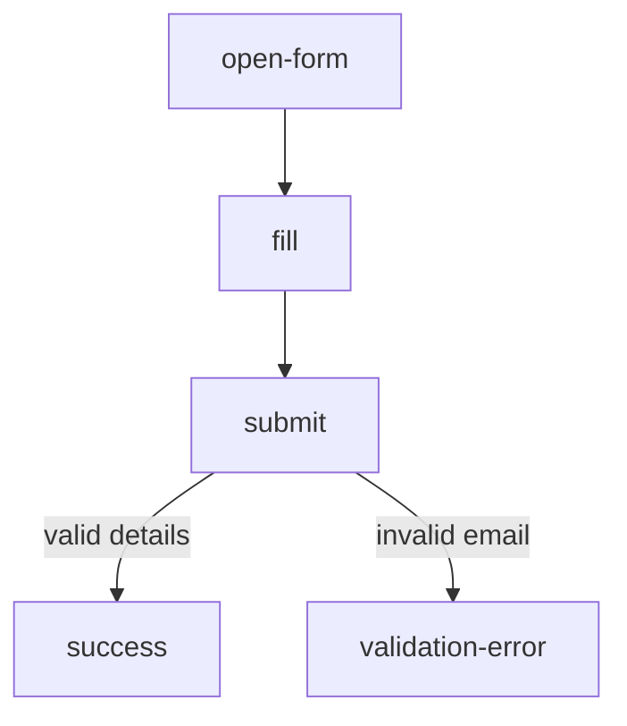
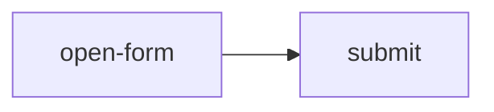

# FlowSpec Language Specification

**Status:** Draft
**Spec version:** 1.0
**Authors:** Constell
**Category:** AI Acceptance Testing Specification

---

## 1. Introduction

FlowSpec is a declarative specification language for AI-driven acceptance testing.

A FlowSpec document does **not** describe browser automation. It describes:

- user journeys (**Flows**)
- logical checkpoints within a journey (**Cases**)
- semantic user interactions (**Steps**)
- expected outcomes (**Assertions**)
- artifacts to capture (**Evidence**)

An **execution engine** — an AI browser agent, a Playwright adapter, a Selenium adapter, a mobile agent — consumes the document and decides *how* to perform the actions. FlowSpec is to AI acceptance testing what OpenAPI is to REST APIs: a framework-independent source of truth for expected behavior that developers, QA engineers, and AI agents all share.

### 1.1 Design principles

| Principle | Meaning |
|---|---|
| **Declarative** | Describes *what* should happen, never *how*. |
| **Semantic** | Targets are stable component names carried by a data attribute, never CSS selectors or XPath. |
| **Human readable** | A QA engineer can read and write a FlowSpec without programming knowledge. |
| **AI readable** | An LLM can execute a FlowSpec without additional prompting. |
| **Engine agnostic** | The same document runs on any conformant engine. |
| **Versioned** | Every document declares the spec version it targets. |

---

## 2. Conformance

The key words **MUST**, **MUST NOT**, **SHOULD**, **SHOULD NOT**, and **MAY** are to be interpreted as described in RFC 2119.

An implementation is a **conformant execution engine** if it:

1. accepts any valid FlowSpec 1.0 document,
2. executes the lifecycle defined in §12,
3. resolves targets as defined in §6,
4. supports all built-in actions (§7) and assertion types (§8), and
5. produces a report as defined in §13, written as defined in §14.

An engine that encounters an unknown action or assertion type **MUST** fail the containing case with status `error` — it **MUST NOT** silently skip it.

---

## 3. Document format

A FlowSpec document is a single JSON object (UTF-8). The recommended file extension is `.flowspec.json`.

### 3.1 Top-level structure

```json
{
  "spec": "1.0",
  "name": "Venue Landing Page",
  "description": "Acceptance tests for the venue landing page.",
  "version": "1.0.0",
  "author": "Constell",
  "tags": ["smoke", "production"],
  "targetAttribute": "data-constell",
  "variables": {},
  "setup": [],
  "flows": [],
  "cleanup": []
}
```

| Field | Type | Required | Description |
|---|---|---|---|
| `spec` | string | **yes** | FlowSpec version this document targets. `"1.0"`. |
| `name` | string | **yes** | Human-readable suite name. |
| `flows` | Flow[] | **yes** | One or more flows (§10). |
| `description` | string | no | What this suite covers. |
| `version` | string | no | Document version (semver recommended). |
| `author` | string | no | Author or team. |
| `tags` | string[] | no | Labels for filtering (`smoke`, `regression`, …). |
| `targetAttribute` | string | no | HTML attribute that carries component names. Default `data-constell` (§6.1). |
| `variables` | object | no | Reusable values (§5). |
| `setup` | Step[] | no | Runs before **each** flow (§11). |
| `cleanup` | Step[] | no | Runs after **each** flow (§11). |
| `evidence` | string[] | no | Default evidence for all cases (§9). |

Engines **MUST** reject a document whose `spec` major version they do not support.

---

## 4. Metadata

The metadata fields (`spec`, `name`, `description`, `version`, `author`, `tags`) live at the top level of the document as shown in §3.1. Only `spec` and `name` are required. Everything else exists for humans and tooling — engines **MUST NOT** change behavior based on `tags`, though runners **MAY** use them to select which documents to execute.

---

## 5. Variables

`variables` is a flat map of names to string values.

```json
{
  "variables": {
    "customerName": "John Doe",
    "email": "john@example.com",
    "venue": "Birthday"
  }
}
```

### 5.1 Interpolation

Any string value in the document may reference a variable with `{{name}}`:

```json
{ "action": "fill", "target": "quote-name", "values": { "name": "{{customerName}}" } }
```

- Interpolation is plain string substitution; whitespace inside braces is ignored (`{{ email }}` ≡ `{{email}}`).
- Referencing an undefined variable is an **error**: the engine **MUST** fail document loading, before any execution.
- Engines **MAY** allow variables to be overridden at invocation time (CLI flags, environment). Overrides replace the document value; they cannot introduce names the document does not declare.

---

## 6. Targets

A **target** is the stable, semantic name of a UI component. Targets decouple the spec from markup: names survive redesigns; selectors do not.

Components under test declare their name with a **target attribute**:

```html
<button data-constell="quote-submit">Request a quote</button>
```

FlowSpec references it by name only:

```json
{ "action": "click", "target": "quote-submit" }
```

### 6.1 The target attribute

The attribute name is a property of the application under test, not of the journey being described, so documents declare it once at the top level:

```json
{
  "spec": "1.0",
  "name": "Venue Landing Page",
  "targetAttribute": "data-testid"
}
```

| | |
|---|---|
| **Field** | `targetAttribute` (string, optional) |
| **Default** | `data-constell` |
| **Constraint** | **MUST** be a valid HTML attribute name matching `^[A-Za-z][A-Za-z0-9_.:-]*$`. Engines **MUST** reject an invalid value at load time. |

Rules:

- Teams already using `data-testid`, `data-qa`, `data-test`, or a house convention adopt FlowSpec by declaring it — no markup migration required.
- A custom attribute **SHOULD** be `data-*` prefixed, so it stays a valid HTML5 custom attribute.
- Exactly one attribute applies per document. Fallback chains are deliberately excluded: two ways to name the same component is how a test suite starts drifting from its markup.
- Engines **MAY** allow the value to be overridden at invocation time (CLI flag, config), which takes precedence over the document. This mirrors variable overrides (§5) and lets one document run against environments whose markup differs.
- The attribute name is meaningless to non-DOM engines (§6.2), which ignore it.

### 6.2 Resolution

- DOM-based engines **MUST** resolve `target: "X"` to `[<targetAttribute>="X"]` — by default `[data-constell="X"]`.
- Non-DOM engines (mobile, desktop) **MUST** map the same names onto their platform's semantic identifiers (e.g. accessibility IDs), ignoring `targetAttribute`.
- If a target resolves to zero elements, the step or assertion referencing it fails.
- If a target resolves to multiple elements, engines **MUST** fail with an ambiguity error unless the assertion is `count` (§8), which operates on the full match set.

### 6.3 Naming convention

Names **SHOULD** be lowercase kebab-case, describe the component's *role* rather than its appearance, and remain stable across UI redesigns:

```
hero  gallery  package-list  package-card  package-price
quote-form  quote-name  quote-email  quote-submit
success-message  faq  footer
```

---

## 7. Steps

A **Step** is a single user interaction. Steps run in array order.

```json
{ "action": "click", "target": "quote-submit" }
```

| Field | Type | Required | Description |
|---|---|---|---|
| `action` | string | **yes** | One of the built-in actions below. |
| `target` | string | see below | Target name (§6). |
| `description` | string | no | Intent of the step, in plain language (§7.3). |
| `timeout` | number | no | Seconds to wait for the step to become possible. Default: engine-defined, **SHOULD** be 30. |
| *(action-specific)* | | | Additional fields per action. |

### 7.1 Built-in actions

| Action | `target` | Additional fields | Description |
|---|---|---|---|
| `navigate` | — | `url` (string, required) | Go to a URL. Relative URLs resolve against the engine's configured base URL. |
| `click` | required | — | Click/tap the component. |
| `double-click` | required | — | Double-click the component. |
| `fill` | required | `values` (object, required) | Fill a form or field; see §7.2. |
| `select` | required | `value` (string, required) | Choose an option by visible label or value. |
| `hover` | required | — | Hover over the component. |
| `scroll` | optional | `to` (`"top"` \| `"bottom"`, default per target) | Scroll the target into view, or the page if no target. |
| `wait` | optional | `seconds` (number) — exactly one of `seconds`/`target` | Pause, or wait for target to become visible. |
| `upload` | required | `file` (string, required) | Attach a file by path. |
| `download` | required | — | Trigger and await a download from the component. |
| `submit` | required | — | Submit the form component. |
| `refresh` | — | — | Reload the page. |
| `back` | — | — | Browser history back. |
| `forward` | — | — | Browser history forward. |
| `press-key` | optional | `key` (string, required) | Press a key (e.g. `"Enter"`, `"Escape"`), on the target if given. |
| `focus` | required | — | Focus the component. |
| `blur` | required | — | Remove focus from the component. |

AI-agent engines **MAY** fulfil an action through equivalent means (e.g. keyboard-driven form fill), provided the user-observable outcome is the same.

### 7.2 Fill

`fill` targets either a single field or a form component. When targeting a form, `values` keys are the target names of fields *within* it:

```json
{
  "action": "fill",
  "target": "quote-form",
  "values": {
    "quote-name": "{{customerName}}",
    "quote-email": "{{email}}"
  }
}
```

### 7.3 Step description

`description` states the step's **intent**, never its mechanics:

```json
{ "action": "click", "target": "cookie-accept", "description": "Dismiss the cookie banner" }
```

It serves two purposes: it appears in reports so a failure reads *"Dismiss the cookie banner — timed out"* rather than `click cookie-accept`, and AI engines **MAY** use it as a disambiguation hint when a target is genuinely ambiguous.

Engines **MUST NOT** change target resolution (§6) based on `description`, and authors **MUST NOT** use it to describe *how* to perform the action ("scroll down 200px, then click the blue button"). A description that explains mechanics is a spec smell — the mechanics belong to the engine.

---

## 8. Assertions

Assertions validate expected outcomes after a case's steps complete.

```json
{ "type": "visible", "target": "success-message" }
```

| Type | `target` | Additional fields | Passes when |
|---|---|---|---|
| `exists` | required | — | Target resolves to at least one element. |
| `visible` | required | — | Target exists and is visible. |
| `hidden` | required | — | Target does not exist or is not visible. |
| `enabled` | required | — | Target is interactable. |
| `disabled` | required | — | Target is not interactable. |
| `checked` | required | — | Checkbox/radio is checked. |
| `unchecked` | required | — | Checkbox/radio is not checked. |
| `count` | required | `expected` (number, required) | Number of matching elements equals `expected`. |
| `text` | required | `expected` (string, required), `match` (`"exact"` \| `"contains"`, default `"contains"`) | Target's visible text matches. |
| `value` | required | `expected` (string, required) | Form field's value equals `expected`. |
| `attribute` | required | `name` (string, required), `expected` (string, required) | Attribute `name` equals `expected`. |
| `url` | — | `expected` (string, required), `match` (as `text`) | Current URL matches. |
| `title` | — | `expected` (string, required), `match` (as `text`) | Page title matches. |
| `console` | — | `level` (`"error"` \| `"warning"`, default `"error"`), `max` (number, default `0`) | At most `max` console entries at `level` since case start. |
| `network` | — | `status` (`"no-errors"`), or `url` + `expected` status code | No failed requests, or a specific request returned the expected status. |
| `performance` | — | `metric` (string, e.g. `"lcp"`), `max` (number, ms) | The metric is at or below `max`. |
| `accessibility` | optional | `standard` (string, default `"wcag2aa"`) | No violations at the given standard, scoped to target or page. |

Every assertion also accepts:

| Field | Type | Required | Description |
|---|---|---|---|
| `description` | string | no | The expectation in plain language, used as the failure message. |
| `timeout` | number | no | Seconds to retry until the assertion holds. Default: engine-defined, **SHOULD** be 5. |

`description` is what makes a report readable by someone who has not read the spec:

```json
{ "type": "visible", "target": "success-message", "description": "The confirmation banner appears" }
```

Engines **SHOULD** use `description` as the failure message when present, falling back to a generated one (`visible: success-message`) when absent.

All assertions in a case **MUST** be evaluated even if an earlier one fails, so a report shows every failed expectation, not just the first.

---

## 9. Evidence

Evidence is the set of artifacts captured when a case finishes.

| Value | Artifact |
|---|---|
| `screenshot` | Full-page screenshot. |
| `dom` | Serialized DOM snapshot. |
| `html` | Raw page HTML. |
| `a11y-tree` | Accessibility tree. |
| `network` | Network log since case start. |
| `console` | Console log since case start. |
| `reasoning` | AI agent's reasoning trace (AI engines only; others **MAY** omit). |
| `performance` | Performance metrics. |
| `timing` | Case execution time. |

Rules:

- `evidence` may be declared at document level (default for every case) and at case level (replaces the document default for that case).
- On any case **failure or error**, engines **MUST** capture at least `screenshot` and `console`, regardless of declared evidence.
- `timing` is always captured; declaring it is unnecessary.

```json
{ "evidence": ["screenshot", "dom", "console"] }
```

---

## 10. Flows and Cases

### 10.1 Flow

A **Flow** is a complete user journey — *Request Quote*, *Download Brochure*, *Book Appointment*.

| Field | Type | Required | Description |
|---|---|---|---|
| `id` | string | **yes** | Unique within the document. Kebab-case recommended. |
| `name` | string | no | Human-readable name. Defaults to `id`. |
| `description` | string | no | What the journey covers. |
| `cases` | Case[] | **yes** | The flow's checkpoints. |
| `edges` | Edge[] | no | Explicit graph structure (§10.3). |

### 10.2 Case

A **Case** is a logical checkpoint within a flow: a group of steps plus the assertions that must hold afterward.

| Field | Type | Required | Description |
|---|---|---|---|
| `id` | string | **yes** | Unique within the flow. |
| `name` | string | no | Human-readable name. Defaults to `id`. |
| `description` | string | no | What this checkpoint verifies and why. |
| `steps` | Step[] | no | Interactions, in order. |
| `assertions` | Assertion[] | no | Evaluated after all steps. |
| `evidence` | string[] | no | Overrides the document default (§9). |

A case's **outcome** is:

- `passed` — all steps executed and all assertions held
- `failed` — steps executed but at least one assertion failed
- `error` — a step could not be executed (target missing, timeout, unknown action)
- `skipped` — never reached (§10.3)

### 10.3 Graph model

A flow is a directed graph: cases are the **nodes**, and `edges` define the paths between them.

**Linear flows (the common case).** When `edges` is omitted, the cases array defines an implicit linear chain: each case leads to the next, and execution stops at the first case that does not pass — subsequent cases are `skipped`.

**Branching flows.** `edges` declares transitions explicitly:

| Field | Type | Required | Description |
|---|---|---|---|
| `from` | string | **yes** | Source case `id`. |
| `to` | string | **yes** | Destination case `id`. |
| `when` | `"passed"` \| `"failed"` | no | Follow this edge only on the given outcome of `from`. Default: `"passed"`. |
| `label` | string | no | Human-readable branch condition, used when rendering the graph (§10.4). |

```json
{
  "edges": [
    { "from": "submit", "to": "success", "when": "passed", "label": "valid details" },
    { "from": "submit", "to": "validation-error", "when": "failed", "label": "invalid email" }
  ]
}
```

`when` describes the *mechanism* (which outcome routes here); `label` describes the *meaning* (why the journey branches). Diagrams read far better with the latter.

Rules:

- When `edges` is present, execution starts at the first case in `cases` and follows edges by outcome. Cases never reached are `skipped`.
- A `when: "failed"` edge makes the failure *expected*: if the failure path completes and passes, the flow **passes**. This is how negative paths (validation errors, empty states) are tested.
- An `error` outcome follows no edges; the flow ends immediately with status `error`.
- The graph **MUST** be acyclic, and every edge **MUST** reference existing case ids. Engines **MUST** validate this at load time.

### 10.4 Mermaid rendering

Because a flow is a directed graph, tooling can render it mechanically — one Mermaid edge per FlowSpec edge (or per implicit linear link):



Rendering rules for generators:

- Node labels **SHOULD** use each case's `name`, falling back to `id`.
- When a node has more than one outgoing edge, generators **SHOULD** label those edges with the edge's `label`, falling back to its `when` value.
- Single outgoing edges **SHOULD** be left unlabeled.

---

## 11. Setup and Cleanup

`setup` and `cleanup` are step arrays with flow-level lifecycle:

- `setup` runs before **each** flow.
- `cleanup` runs after **each** flow — including flows that failed or errored. Cleanup failures **MUST** be reported but **MUST NOT** change the flow's result.

```json
{
  "setup":   [ { "action": "navigate", "url": "/birthday" } ],
  "cleanup": [ { "action": "clear-storage" } ]
}
```

In addition to the built-in actions of §7, setup/cleanup may use:

| Action | Fields | Description |
|---|---|---|
| `clear-storage` | — | Clear cookies, localStorage, and sessionStorage. |

Flows **MUST** be independent: engines **MAY** run them in any order, and a flow **MUST NOT** depend on state left behind by another flow.

---

## 12. Execution lifecycle

```
Load & validate document          (schema, variables, targetAttribute, graph integrity)
└─ for each flow:
   ├─ Run setup
   ├─ Execute cases along the graph (§10.3)
   │   └─ for each case: run steps → evaluate assertions → collect evidence
   └─ Run cleanup
Generate report
```

Failure semantics, in one place:

| Situation | Result |
|---|---|
| Undefined variable, invalid schema, cyclic graph, invalid `targetAttribute` | Document rejected at load; nothing runs. |
| Setup step fails | Flow preconditions unmet; all its cases `skipped`, flow = `error`. Cleanup still runs. |
| Step fails (target missing, timeout) | Remaining steps and assertions in the case are skipped; case = `error`. |
| Assertion fails | Remaining assertions still evaluated; case = `failed`. |
| Case fails/errors, no matching edge | Downstream cases `skipped`; flow = case's outcome. |
| Case fails, `when: "failed"` edge exists | Execution continues along that edge (§10.3). |
| Cleanup step fails | Reported; flow result unchanged. |
| Flow fails | Remaining flows still run (flows are independent). |

---

## 13. Reporting

An execution produces a JSON report:

```json
{
  "status": "passed",
  "spec": "1.0",
  "name": "Venue Landing Page",
  "startedAt": "2026-07-27T12:00:00Z",
  "duration": 7.42,
  "summary": { "flows": 4, "cases": 18, "assertions": 91, "failed": 0, "errors": 0, "skipped": 0 },
  "flows": [
    {
      "id": "request-quote",
      "name": "Request Quote",
      "description": "Visitor requests a quote.",
      "status": "passed",
      "duration": 3.1,
      "cases": [
        {
          "id": "submit",
          "name": "Submit Quote",
          "description": "Submits valid details and expects the confirmation panel.",
          "status": "passed",
          "duration": 1.4,
          "steps": [
            {
              "action": "submit",
              "target": "quote-form",
              "description": "Send the quote request",
              "status": "passed"
            }
          ],
          "assertions": [
            {
              "type": "visible",
              "target": "success-message",
              "description": "The confirmation banner appears",
              "status": "passed"
            }
          ],
          "evidence": { "screenshot": "evidence/request-quote/submit/screenshot.png" }
        }
      ]
    }
  ]
}
```

- `status` at every level is `passed` | `failed` | `error` | `skipped`. A parent's status is the worst of its children (`error` > `failed` > `passed`; `skipped` children don't degrade a parent).
- Durations are seconds.
- `evidence` maps each collected artifact to a path relative to the results directory (§14.3).
- Engines **MAY** add engine-specific fields; consumers **MUST** ignore fields they don't recognize.

### 13.1 Human-readable output

Names and descriptions exist to make this report legible, so engines **MUST** carry them through:

- Every flow and case in the report **MUST** include its `name` (falling back to `id`) and its `description` when the document declares one.
- Every reported step and assertion **MUST** include its `description` when declared.
- A failed assertion's message **SHOULD** be its `description`, falling back to a generated one (§8).

A reader who has never opened the FlowSpec document **SHOULD** be able to understand a failure from the report alone.

---

## 14. Results output

§13 defines the *shape* of a result. This section defines *where* it lands, so that CI pipelines, dashboards, and flake trackers work against any conformant engine rather than being rewritten per engine.

### 14.1 Directory layout

Engines write results to a single **results directory**, which **SHOULD** default to `flowspec-results/` and **MUST** be overridable by the user:

```
flowspec-results/
├── report.json                              # the report defined in §13
├── report.xml                               # optional JUnit XML (§14.4)
└── evidence/
    └── <flow-id>/
        ├── _setup/                          # evidence from setup steps, if any
        │   └── screenshot.png
        └── <case-id>/
            ├── screenshot.png
            ├── dom.html
            └── console.log
```

Rules:

- Engines **MUST NOT** write outside the results directory.
- The directory **MUST** be safe to delete and regenerate: a run **MUST NOT** depend on artifacts from a previous run.
- A run **MUST** overwrite the previous run's results rather than accumulating timestamped directories. Archiving history is CI's job, not the engine's.

Artifact filenames need no counters or hashes because a case is visited at most once per run — the acyclicity requirement of §10.3 guarantees `evidence/<flow-id>/<case-id>/` is collision-free.

### 14.2 Artifact filenames

| Evidence | Filename |
|---|---|
| `screenshot` | `screenshot.png` |
| `dom` | `dom.html` |
| `html` | `page.html` |
| `a11y-tree` | `a11y-tree.json` |
| `network` | `network.json` |
| `console` | `console.log` |
| `reasoning` | `reasoning.md` |
| `performance` | `performance.json` |

### 14.3 Path references and portability

Evidence paths in `report.json` **MUST** be relative to the results directory:

```json
{ "evidence": { "screenshot": "evidence/request-quote/submit/screenshot.png" } }
```

Absolute paths **MUST NOT** be used. This is what makes the results directory a self-contained bundle: it can be zipped, uploaded as a CI artifact, or attached to a pull request, and every reference still resolves.

Engines that upload evidence to remote storage **MAY** instead emit absolute `https:` URIs. A report **MUST NOT** mix the two styles.

### 14.4 Case identity and CI integration

A case's **fully-qualified id** is `<flow-id>/<case-id>` — for example `request-quote/submit`. It is stable across runs and is the key that flake trackers and history dashboards **SHOULD** use to correlate a case with its previous results.

Engines **SHOULD** additionally emit JUnit XML as `report.xml`, since it is the format CI systems already understand:

| JUnit | FlowSpec |
|---|---|
| `<testsuite name>` | Flow `name`, falling back to `id` |
| `<testcase classname>` | Flow `id` |
| `<testcase name>` | Case `name`, falling back to `id` |
| `<failure message>` | The failed assertion's `description` (§13.1) |
| `<error message>` | The failing step's `description` and reason |
| `<skipped>` | Cases with status `skipped` |

### 14.5 Exit codes

A conformant runner **MUST** exit with:

| Code | Meaning |
|---|---|
| `0` | Every flow passed. |
| `1` | At least one flow failed — the application under test did not meet expectations. |
| `2` | At least one flow errored, or the document was invalid — the run itself did not complete. |

The distinction between `1` and `2` matters in CI: `1` is a product bug, `2` is a broken test run or environment, and pipelines usually treat them differently.

---

## 15. Versioning and extensibility

- The `spec` field uses `major.minor`. Minor versions are backward compatible; engines supporting `1.x` **MUST** accept any `1.y ≤ x` document.
- Unknown *document* fields are reserved: engines **MUST** ignore unrecognized top-level and object-level fields (forward compatibility), but **MUST** reject unknown `action` and assertion `type` values (§2).

Candidate features deliberately **out of scope** for 1.0: loops, parallel execution, imports/shared flows, AI-generated flows, visual regression, Lighthouse audits, API testing, database assertions, native desktop support.

---

## 16. Complete example

```json
{
  "spec": "1.0",
  "name": "Venue Quote Flow",
  "description": "A visitor requests a quote from the venue landing page.",
  "version": "1.0.0",
  "author": "Constell",
  "tags": ["smoke"],

  "variables": {
    "customerName": "John Doe",
    "email": "john@example.com"
  },

  "setup": [
    { "action": "navigate", "url": "/birthday" }
  ],

  "flows": [
    {
      "id": "request-quote",
      "name": "Request Quote",
      "description": "A visitor opens the quote form and submits valid details.",
      "cases": [
        {
          "id": "open-form",
          "name": "Open Form",
          "description": "The quote form is reachable from the landing page.",
          "steps": [
            {
              "action": "click",
              "target": "quote-button",
              "description": "Open the quote form"
            }
          ],
          "assertions": [
            {
              "type": "visible",
              "target": "quote-form",
              "description": "The quote form is shown"
            }
          ]
        },
        {
          "id": "submit",
          "name": "Submit Quote",
          "description": "Valid details produce a confirmation and no console errors.",
          "steps": [
            {
              "action": "fill",
              "target": "quote-form",
              "description": "Enter the visitor's contact details",
              "values": {
                "quote-name": "{{customerName}}",
                "quote-email": "{{email}}"
              }
            },
            {
              "action": "submit",
              "target": "quote-form",
              "description": "Send the quote request"
            }
          ],
          "assertions": [
            {
              "type": "visible",
              "target": "success-message",
              "description": "The confirmation banner appears"
            },
            {
              "type": "console",
              "level": "error",
              "max": 0,
              "description": "No console errors during submission"
            }
          ],
          "evidence": ["screenshot", "dom", "console"]
        }
      ]
    }
  ],

  "cleanup": [
    { "action": "clear-storage" }
  ]
}
```

Rendered flow:


