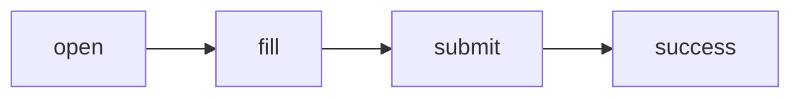
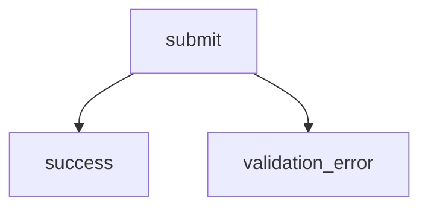

# FlowSpec Language Specification v1.0

**Status:** Draft
**Version:** 1.0
**Authors:** Constell
**Category:** AI Acceptance Testing Specification

---

# 1. Overview

FlowSpec is a declarative specification language for AI-driven acceptance testing.

Unlike Playwright, Cypress, or Selenium, FlowSpec **does not describe browser automation**.

Instead, it describes:

* user journeys
* expected behavior
* semantic UI interactions
* assertions
* evidence

The execution engine (AI agent, Playwright adapter, etc.) decides how to perform the actions.

---

# 2. Design Principles

FlowSpec follows these principles.

## Declarative

Describe **what** should happen.

Not **how** it happens.

---

## Semantic

FlowSpec interacts with semantic components.

Never CSS.

Never XPath.

Every component has

```html
data-constell="quote-submit"
```

---

## Human Readable

A QA engineer should understand a FlowSpec without knowing programming.

---

## AI Readable

An LLM should execute a FlowSpec without additional prompting.

---

## Execution Engine Agnostic

Supported engines may include

* AI Browser Agent
* Playwright
* Selenium
* Cypress
* Mobile Agent

---

## Versioned

Every document declares its specification version.

---

# 3. Document Structure

```
FlowSpec
│
├── Metadata
├── Variables
├── Setup
├── Flows
│
│     ├── Cases
│     │
│     ├── Steps
│     ├── Assertions
│     └── Evidence
│
├── Cleanup
└── Reporting
```

---

# 4. Metadata

Required.

```json
{
  "spec": "1.0",

  "name": "Venue Landing Page",

  "description": "Acceptance tests for venue landing page.",

  "version": "1.0.0",

  "author": "Constell",

  "tags": [
    "smoke",
    "production"
  ]
}
```

---

# 5. Variables

Reusable values.

```json
{
  "variables": {

    "customerName": "John Doe",

    "email": "john@example.com",

    "venue": "Birthday"

  }
}
```

Variables may be referenced.

```
{{customerName}}
```

---

# 6. Setup

Runs before every Flow.

Example

```json
{
  "setup": [

    {
      "action": "navigate",

      "url": "/birthday"
    }

  ]
}
```

---

# 7. Cleanup

Runs after execution.

Example

```json
{
  "cleanup": [

    {
      "action": "clear-storage"
    }

  ]
}
```

---

# 8. Flow

A Flow represents a complete user journey.

Examples

* Request Quote
* Download Brochure
* Contact Venue
* Book Appointment

Example

```json
{
  "id": "request-quote",

  "name": "Request Quote",

  "description": "Visitor requests a quote."
}
```

---

# 9. Case

A Case represents a logical checkpoint.

Examples

```
Request Quote

├── Open Form

├── Fill Form

├── Submit

└── Confirmation
```

Example

```json
{
  "id": "submit",

  "name": "Submit Quote"
}
```

Cases are graph nodes.

---

# 10. Step

A Step is a user interaction.

Built-in actions

```
navigate

click

double-click

fill

select

hover

scroll

wait

upload

download

submit

refresh

back

forward

press-key

focus

blur
```

Example

```json
{
  "action": "click",

  "target": "quote-submit"
}
```

---

## Fill

```json
{
  "action": "fill",

  "target": "quote-form",

  "values": {

      "name": "{{customerName}}",

      "email": "{{email}}"

  }
}
```

---

# 11. Targets

Targets reference semantic UI components.

```
data-constell
```

Example

```html
<button data-constell="quote-submit">
```

FlowSpec

```json
{
  "target": "quote-submit"
}
```

Execution engines resolve

```
[data-constell="quote-submit"]
```

---

# 12. Assertions

Assertions validate expected outcomes.

Supported assertions

```
exists

visible

hidden

enabled

disabled

checked

unchecked

count

text

value

attribute

url

title

console

network

performance

accessibility
```

Example

```json
{
  "assertions": [

    {

      "type": "visible",

      "target": "success-message"

    }

  ]
}
```

---

# 13. Evidence

Evidence is collected during execution.

Supported evidence

```
Screenshot

DOM Snapshot

HTML

Accessibility Tree

Network Logs

Console Logs

Reasoning

Performance Metrics

Execution Time
```

Example

```json
{
  "evidence": [

    "screenshot",

    "dom",

    "console"

  ]
}
```

---

# 14. Graph Model

FlowSpec is a directed graph.

```
Flow

├── Nodes (Cases)

└── Edges
```

Example

```json
{
  "flow": {

    "nodes": [

      {
        "id": "open"
      },

      {
        "id": "fill"
      },

      {
        "id": "submit"
      },

      {
        "id": "success"
      }

    ],

    "edges": [

      {
        "from": "open",

        "to": "fill"
      },

      {
        "from": "fill",

        "to": "submit"
      },

      {
        "from": "submit",

        "to": "success"
      }

    ]
  }
}
```

---

# 15. Mermaid Compatibility

Every Flow can be rendered as Mermaid.



Branching



The graph is generated automatically.

---

# 16. Conditions

Cases may have multiple outcomes.

```json
{
  "edges": [

    {
      "from": "submit",

      "to": "success",

      "when": "success"
    },

    {
      "from": "submit",

      "to": "validation-error",

      "when": "failure"
    }

  ]
}
```

---

# 17. Reporting

Every execution returns

```json
{
  "status": "PASS",

  "duration": 7.42,

  "flows": 4,

  "cases": 18,

  "assertions": 91,

  "failed": 0
}
```

---

# 18. Execution Lifecycle

```
Load FlowSpec

↓

Resolve Variables

↓

Run Setup

↓

Execute Flow

↓

Execute Cases

↓

Execute Steps

↓

Evaluate Assertions

↓

Collect Evidence

↓

Generate Report

↓

Cleanup
```

---

# 19. Naming Convention

Recommended

```
hero

gallery

package-list

package-card

package-price

quote-form

quote-name

quote-email

quote-submit

success-message

faq

footer
```

Names should remain stable across UI redesigns.

---

# 20. Extensibility

Future versions may add:

* Conditions
* Loops
* Parallel execution
* Imports
* Shared flows
* AI-generated flows
* Visual regression
* Lighthouse
* Accessibility audits
* API testing
* Database assertions
* Mobile support
* Native desktop support

---

# 21. Complete Example

```json
{
  "spec": "1.0",

  "name": "Venue Quote Flow",

  "variables": {
    "customerName": "John Doe",
    "email": "john@example.com"
  },

  "flows": [
    {
      "id": "request-quote",

      "cases": [
        {
          "id": "open-form",

          "steps": [
            {
              "action": "click",
              "target": "quote-button"
            }
          ],

          "assertions": [
            {
              "type": "visible",
              "target": "quote-form"
            }
          ]
        },

        {
          "id": "submit",

          "steps": [
            {
              "action": "fill",

              "target": "quote-form",

              "values": {
                "name": "{{customerName}}",
                "email": "{{email}}"
              }
            },

            {
              "action": "submit",

              "target": "quote-form"
            }
          ],

          "assertions": [
            {
              "type": "visible",
              "target": "success-message"
            }
          ],

          "evidence": [
            "screenshot",
            "dom",
            "console"
          ]
        }
      ]
    }
  ]
}
```

## Guiding Philosophy

FlowSpec should be to AI acceptance testing what **OpenAPI** is to REST APIs: a framework-independent, declarative specification that defines expected behavior. Execution engines consume the same FlowSpec and are free to choose the best implementation strategy, while developers and AI agents share a single, stable source of truth for acceptance criteria.
